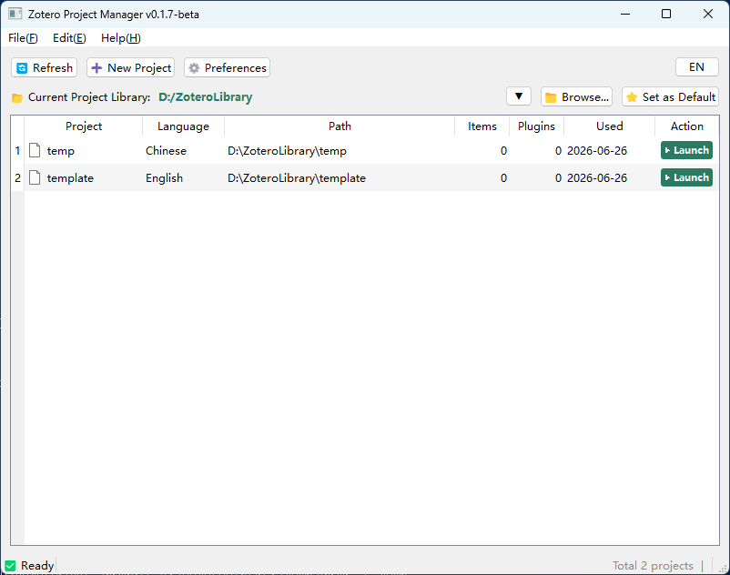
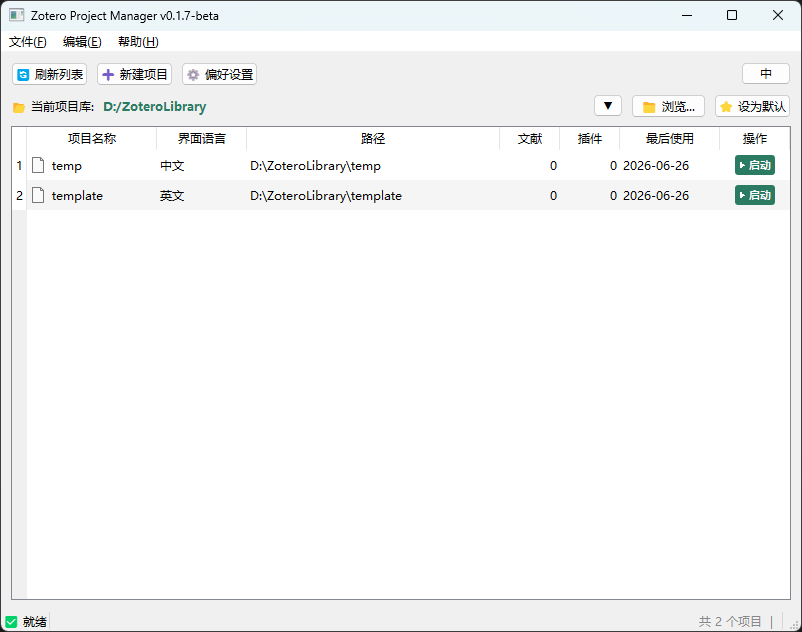

# Zotero Project Manager (ZPM)

[](LICENSE)
[](https://www.python.org/)
[](CHANGELOG.md)


---

[English](#english) | [中文](#中文)

---

<a name="english"></a>

## What is ZPM?

**ZPM turns Zotero from "one database" into "multiple independent project folders."**

Zotero's default mode is account-based — all your references live in one database. Collections are like tags: they group things logically, but they don't physically separate your research topics.

ZPM is an enhancement tool for Zotero — it directs Zotero to create an independent configuration and data environment for each project. It's like having a separate Zotero for every research topic.

ZPM displays and manages all your projects in one place. You can quickly create, launch, rename, and import/export (migrate) projects — all in just a few clicks, with no technical knowledge required.



---

## Features

- **Create Project**: Create an independent Zotero project with one click
- **Launch Project**: Select a project and double-click, or click the "Launch" button
- **Import/Export**: Select a project, then right-click or use the Edit menu → Import/Export
- **Rename Project**: Select a project, then right-click or use the Edit menu → Rename
- **Repair Project**: Help → Repair Launch, one-click fix for launch or shortcut issues
- **Bilingual UI**: Switch between Chinese and English with one click at the top-right corner

---

## Quick Start

### Download exe (Recommended)

1. Go to the [Releases page](https://github.com/alexonqin/ZoteroProjectManager/releases)
2. Download the latest `ZoteroProjectManager_vX.X.X-beta_Win64.zip`
3. Extract and double-click `ZoteroProjectManager.exe`
4. Follow the setup wizard to configure Zotero path and project library directory
5. Click "New Project" to get started

> 💡 No Python installation required – just extract and run.

### Run from source (Developers / Advanced users)

```bash
git clone https://github.com/alexonqin/ZoteroProjectManager.git
cd ZoteroProjectManager
pip install -r requirements.txt
python src/main.py
```

### CLI Tools (Advanced users)

ZPM includes built-in CLI support for automation or headless environments:

```bash
# Execute launch repair
ZoteroProjectManager.exe --fix

# Execute shortcut repair
ZoteroProjectManager.exe --rebuild-shortcuts

# Show help
ZoteroProjectManager.exe --help
```
---
> [!IMPORTANT]
> **⚠️ Important: Do Not Sign In to Your Zotero Account**
>
> ZPM is a local-only tool. Do not sign in to your Zotero account inside projects created by ZPM. Signing in triggers cloud sync, which breaks ZPM's "local isolation" — each project is an independent folder with its own data, plugins, and preferences.
>
> Zotero Account Mode is for cross-device syncing; ZPM Local Mode is for multi-project local management. Use them separately.
>
> **ZPM projects stay local. Do not connect them to the cloud.**

## Status

Current version: **v0.1.7-beta**

- ✅ Core features stable
- ✅ Full bilingual UI
- 🚧 Actively developing – feedback welcome

---

## License

MIT License

---

## Author

alexonqin

---

---

<a name="中文"></a>

## 这是什么？

**ZPM 把 Zotero 从“一个数据库”变成“多个独立项目文件夹。”**

Zotero 默认是账户模式——所有文献集中在一个数据库中。分类就像给文献打标签，只能逻辑分组，不同课题之间无法做到真正的物理隔离。

ZPM 是 Zotero 的增强工具——它指挥 Zotero，为每个项目单独创建一套独立的配置和数据环境，相当于给每个课题都配了一个“独立的 Zotero”。

ZPM 集中显示并管理所有项目，可快速进行新建、启动、重命名、导入导出（迁移），点几下鼠标就能完成，不需要了解任何技术细节。



---

## 它能做什么？

- **新建项目**：一键创建独立的 Zotero 项目
- **启动项目**：选中项目后双击，或点击「启动」按钮
- **导入/导出**：选中项目后，右键或编辑菜单 → 导入/导出
- **项目重命名**：选中项目后，右键或编辑菜单 → 重命名
- **项目修复**：帮助 → 项目修复，一键修复启动或快捷方式问题
- **中英文界面**：主界面右上角一键切换

---

## 快速开始

### 下载 exe（推荐）

1. 访问 [Releases 页面](https://github.com/alexonqin/ZoteroProjectManager/releases)
2. 下载最新版本的 `ZoteroProjectManager_vX.X.X-beta_Win64.zip`
3. 解压后双击 `ZoteroProjectManager.exe`
4. 按照引导设置 Zotero 路径和项目库目录
5. 点击「新建项目」开始使用

> 💡 无需安装 Python，解压即用。

### 源码运行（开发者/高级用户）

```bash
git clone https://github.com/alexonqin/ZoteroProjectManager.git
cd ZoteroProjectManager
pip install -r requirements.txt
python src/main.py
```

### 命令行工具（高级用户）

ZPM 内置 CLI 支持，适合自动化或无 GUI 环境：

```bash
# 执行启动修复
ZoteroProjectManager.exe --fix

# 执行快捷方式修复
ZoteroProjectManager.exe --rebuild-shortcuts

# 查看帮助
ZoteroProjectManager.exe --help
```

---

> [!IMPORTANT]
> **⚠️ 重要：请勿登录 Zotero 账户**
>
> ZPM 是纯本地工具，请勿在 ZPM 创建的项目中登录 Zotero 账户。登录账户会触发云端同步，破坏 ZPM 的“本地隔离”设计——每个项目都是独立的文件夹，数据、插件、配置互不干扰。
>
> Zotero 账户模式用于跨设备同步，ZPM 本地模式用于多课题本地管理，两者独立使用，互不冲突。
>
> **ZPM 管理的项目保持本地，不可登录云端。**

## 项目状态

当前版本：**v0.1.7-beta**

- ✅ 核心功能稳定
- ✅ 完整中英文界面
- 🚧 仍在积极开发中，欢迎反馈

---

## 许可证

本项目采用 [MIT License](LICENSE)。

---

## 作者

alexonqin
